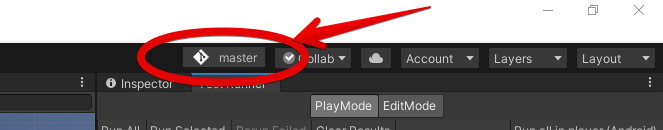

# UnityVCSInfo
Obtain VCS info inside Unity.

## Where is? 
At the top right side of the editor window, aside of account button.

## What can it do?
Basically it shows you a branch you are currently using. If you click on the button, there will be shown a window with the next following things:
1. __VCS__ - Version Control System name
2. __Repository__ - repository name
3. __Branch__ - current branch name

## Why do I need this?
Just for a comfort. :)
